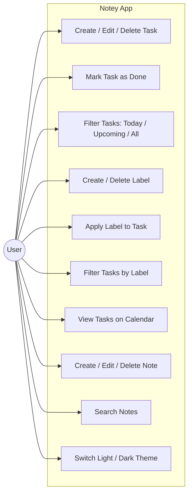
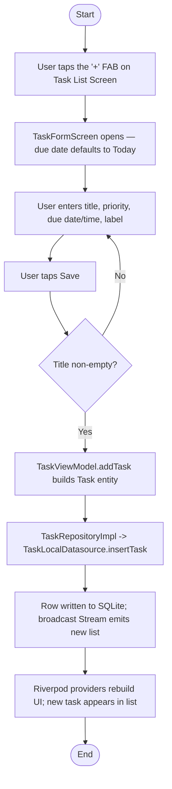
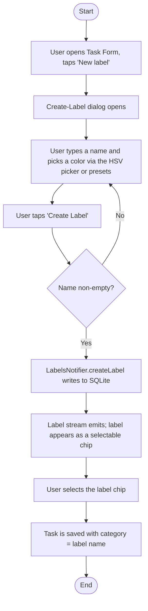
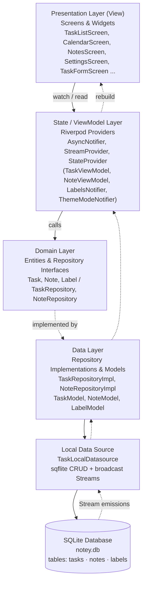

# Notey

### *Your Focus, Refined.*

A minimalist, offline-first productivity app for tasks, calendar planning, and notes — built with Flutter.

**Author:** Vexyruu
**Repository:** [github.com/vexyruu/Notey](https://github.com/vexyruu/Notey)
**Demo Video:** [Insert demo video link here]

---

## Table of Contents

1. [Application Description](#1-application-description)
2. [Use Case & Flowchart](#2-use-case--flowchart)
3. [Application Architecture (MVVM)](#3-application-architecture-mvvm)
4. [Feature Explanation](#4-feature-explanation)
5. [Technologies Used](#5-technologies-used)
6. [Screenshots](#6-screenshots)
7. [GitHub & Video Demo Links](#7-github--video-demo-links)
8. [Conclusion & Future Development Plan](#8-conclusion--future-development-plan)

---

## 1. Application Description

**Notey** is a cross-platform productivity application built with Flutter that combines three core workflows in one place: **task management**, **calendar planning**, and **note-taking**. It targets users who want a fast, distraction-free tool to organize their day without the clutter of feature-bloated to-do apps.

The app is fully **offline-first** — all data (tasks, notes, and labels) is persisted locally on-device using SQLite (`sqflite`), so it works with zero network dependency. The UI follows a custom dark/light design system built around an "Electric Indigo" accent color, DM Sans / Inter for UI text, and Playfair Display italic for editorial-style headings (e.g. "Your *Focus* Today").

Key design goals pursued during development:

- **Clarity over density** — the task screen was deliberately simplified from five overlapping filters (Today / Upcoming / All / Active / Done) down to three unambiguous views (Today / Upcoming / All), with completed tasks shown inline (struck-through, dimmed) rather than hidden behind a separate tab.
- **Color-coded organization** — a full custom **labels** system (replacing a free-text "category" field) lets users tag tasks with named, colored labels created through a custom HSV color picker, then filter the task list by label.
- **Reactive, optimistic UI** — state changes (completing a task, creating a label) reflect in the UI immediately, before the underlying database write/stream round-trip completes, so the app never feels laggy.
- **Consistent, hand-built UI components** — rather than relying on default Material dialogs/snackbars, the app uses a custom `AppDialog` / `AppDeleteDialog` system styled to match the app's own surface colors and typography.

---

## 2. Use Case & Flowchart

### 2.1 Use Case Diagram

### 2.2 Flowchart — Add New Task

### 2.3 Flowchart — Create & Apply a Label

---

## 3. Application Architecture (MVVM)

Notey follows an **MVVM-inspired layered architecture**, adapted around Riverpod as the state-management/binding layer instead of a traditional `ViewModel` base class:

**Data flow is unidirectional and reactive:**

1. Widgets **watch** Riverpod providers (`ref.watch`) for state, and **read** notifiers (`ref.read`) to trigger actions.
2. Providers/notifiers (the "ViewModel" layer) call into repository interfaces defined in the domain layer.
3. Repository implementations translate domain entities (`Task`, `Note`, `Label`) to/from persistence models (`TaskModel`, `NoteModel`, `LabelModel`) and delegate to the local data source.
4. `TaskLocalDatasource` performs raw `sqflite` CRUD operations and re-broadcasts the full updated collection through `StreamController.broadcast()` instances (one per entity type) on every write.
5. `StreamProvider`s watch those streams, so **any** write anywhere in the app automatically propagates back up through every layer and triggers a UI rebuild — without manual cache invalidation.

### Notable architectural decisions

- **`ref.read` vs `ref.watch` in notifier `build()`**: `LabelsNotifier.build()` deliberately uses `ref.read(labelsStreamProvider.future)` instead of `ref.watch(...)`, to avoid the notifier rebuilding (and cascading) on every stream emission — the UI reads reactive state from `labelsProvider` directly instead.
- **Self-contained dialog widgets**: Dialogs (`_CreateLabelDialog`, `AppDeleteDialog`, etc.) are implemented as their own `ConsumerStatefulWidget`/`StatelessWidget` with their own `BuildContext`, rather than closures inside `showDialog(builder: ...)` that capture an outer screen's context. Capturing the outer context caused a Flutter `InheritedElement._dependents.isEmpty` assertion crash when the parent screen rebuilt while the dialog was open.
- **Optimistic UI updates**: `_SquareCheckbox` (the task completion checkbox) is a `StatefulWidget` that flips its visual state immediately on tap, before the async DB write + stream round-trip resolves, then reconciles with the authoritative value once the stream confirms it.

---

## 4. Feature Explanation

### 4.1 Task Management

- Create, edit, and delete tasks with a **title**, optional **description**, **priority** (Low / Medium / High — color-coded with a flag icon), optional **due date + time**, and an optional **label**.
- Three task views, switched via pill-style filter tabs:
  - **Today** — active tasks due today or overdue, reorderable via drag handles (`SliverReorderableList`).
  - **Upcoming** — active tasks with a future due date, grouped under date headers ("Tomorrow", weekday names, or `MMM d`).
  - **All** — every non-deleted task, active tasks first then completed tasks (shown at 45% opacity with strikethrough).
- New tasks default their due date to **today**, so they immediately surface in the Today view instead of disappearing into an undated limbo.
- Swipe-to-delete via `flutter_slidable`.
- Tapping a task opens a full **Task Detail** screen; tapping the checkbox toggles completion with immediate optimistic feedback.

### 4.2 Labels

- Fully custom labeling system that replaced an earlier free-text "category" field.
- Labels have a **name** and a **color**, picked via a hand-built **HSV color picker** (2D saturation/value pad + hue bar + live hex preview) or one of 6 quick preset swatches.
- Labels can be **deleted** via long-press on a label chip (with haptic + visual red-tint feedback while held, then a themed confirmation dialog) — tasks referencing a deleted label simply keep the label's name as plain text.
- The task list can be filtered by label using colored chips at the top of the Today/All views.
- On task cards, labels render as a small tinted **pill badge** (colored dot + name on a tinted background), visually distinct from priority (which renders as a flag icon + text) — addressing earlier ambiguity where both used the same "dot + text" treatment.

### 4.3 Calendar

- Month-view calendar (`table_calendar`) showing a colored marker on any day with at least one task due.
- Selecting a day reveals that day's tasks in a list below the calendar, reusing the same `TaskListItem` widget as the main task list.

### 4.4 Notes

- Lightweight note-taking with a title, free-form content body, and a responsive 2-column grid layout.
- Live search across note titles and content.
- Long-press a note card to delete it (with haptic feedback and a themed confirmation dialog); tapping opens the full note editor.
- Notes auto-derive a display title from the first line of content when no title is set.

### 4.5 Settings / Profile

- Theme switcher: **System / Light / Dark**, persisted via `shared_preferences`.
- Placeholder sections for account sign-in and data export/import, scaffolded for future cloud-sync work (see [§8](#8-conclusion--future-development-plan)).

### 4.6 Onboarding / Splash

- Custom animated splash screen: the "Notey" wordmark reveals with a staged fade/scale/blur animation, followed by a loader bar fill, before transitioning into the main app shell with a smooth cross-fade.
- Custom app icon (indigo rounded-square mark on a dark `#13131B` background) generated for Android/iOS via `flutter_launcher_icons`.

---

## 5. Technologies Used

### 5.1 Core Framework

| Technology | Purpose |
|---|---|
| **Flutter** (Dart SDK `^3.12.2`) | Cross-platform UI framework (Android, iOS, Windows, Web) |
| **flutter_riverpod** `^2.5.0` | State management — `AsyncNotifier`, `StreamProvider`, `StateProvider`, `Provider` |

### 5.2 Persistence

| Technology | Purpose |
|---|---|
| **sqflite** `^2.3.0` | Local relational database (SQLite) for tasks, notes, and labels |
| **path** / **path_provider** | Resolving the on-device database file path |
| **shared_preferences** `^2.2.0` | Lightweight key-value storage for the persisted theme preference |

**Database schema** (`notey.db`, schema version 4):

| Table | Key Columns |
|---|---|
| `tasks` | `id`, `title`, `description`, `isCompleted`, `priority`, `dueDate`, `category`, `sortOrder`, `hasTime`, `isSynced`, `isDeleted`, `createdAt`, `updatedAt` |
| `notes` | `id`, `title`, `content`, `isDeleted`, `createdAt`, `updatedAt` |
| `labels` | `id`, `name` (unique), `colorValue`, `createdAt` |

Indexes exist on `isCompleted`, `isSynced`, and `dueDate` for fast filtering.

### 5.3 UI / UX

| Technology | Purpose |
|---|---|
| **google_fonts** `^6.2.0` | DM Sans (headings/UI), Inter (body), Playfair Display (italic editorial accents) |
| **table_calendar** `^3.1.2` | Month-view calendar widget |
| **flutter_slidable** `^3.1.0` | Swipe-to-delete gesture on task list items |
| **cupertino_icons** | iOS-style iconography |
| Custom `CustomPainter` widgets | Hand-built HSV color picker (saturation/value pad + hue gradient bar) |

### 5.4 Utilities

| Technology | Purpose |
|---|---|
| **intl** `^0.19.0` | Date formatting (`MMM d`, weekday names, relative note timestamps) |
| **uuid** `^4.3.0` | Generating unique IDs for tasks, notes, and labels |
| **flutter_launcher_icons** `^0.14.3` | Generating platform app icons from a single source image |

### 5.5 Configured for future use

These dependencies are present in `pubspec.yaml` to support planned features (see [§8](#8-conclusion--future-development-plan)) but are not yet wired into the app logic:

| Technology | Intended Purpose |
|---|---|
| **flutter_local_notifications** `^17.0.0` | Local push reminders for due tasks |
| **timezone** `^0.9.0` | Timezone-aware notification scheduling |
| **connectivity_plus** `^6.0.0` | Network-state detection for cloud sync |

> **API note:** Notey currently has **no remote/cloud API** — it is entirely local-first. The `isSynced` flag already present on the `Task` model is groundwork for a future sync backend.

---

## 6. Screenshots

> _Screenshots were not available to embed in this README at the time of writing (no Android/iOS device or emulator was connected during documentation, and the Windows desktop target requires `sqflite_common_ffi` initialization that the project doesn't yet include). Capture and add screenshots manually using the table below as a checklist._

| Screen | What to capture |
|---|---|
| Splash screen | Logo reveal animation mid-fade, loader bar |
| Task List — Today | Filter tabs, label filter chips, task cards with priority flag + label pill |
| Task List — Upcoming | Date-grouped headers |
| Task List — All | Mixed active + completed (strikethrough) tasks |
| Task Form | Title/description fields, priority selector, due date/time pickers, label picker |
| Create Label dialog | HSV color picker + preset swatches |
| Delete confirmation dialog | Split-button "Cancel / Delete" style |
| Calendar | Month view with task markers, selected-day task list |
| Notes grid | 2-column note cards, search bar |
| Note editor | Title + content fields |
| Settings / Profile | Theme switcher, account/data placeholder sections |

---

## 7. GitHub & Video Demo Links

- **GitHub Repository:** [https://github.com/vexyruu/Notey](https://github.com/vexyruu/Notey)
- **Video Demo:** [Insert demo video link here]

---

## 8. Conclusion & Future Development Plan

### Conclusion

Notey demonstrates a complete, offline-first productivity app built on a clean MVVM-style layered architecture with Riverpod, covering three interconnected feature domains (tasks, calendar, notes) unified by a custom labeling and theming system. The project emphasizes **UI polish and interaction correctness** as first-class concerns — optimistic state updates, deliberate long-press affordances with haptic + visual feedback, and a hand-rolled dialog/color-picker system consistent with the app's own design language, rather than relying on default Material widgets.

### Future Development Plan

- **Cloud sync & multi-device support** — the `isSynced` field on `Task` and the `connectivity_plus` dependency are groundwork for a future backend (e.g. Firebase/Supabase) to sync tasks/notes/labels across devices, including the "Sign in with Google" placeholder already scaffolded in Settings.
- **Local notifications** — wire up `flutter_local_notifications` + `timezone` to deliver reminders ahead of a task's due date/time.
- **Data export/import** — implement the placeholder Settings actions to export/import a full backup (tasks, notes, labels) as a portable file (e.g. JSON).
- **Desktop platform support** — add `sqflite_common_ffi` initialization in `main.dart` so the existing Windows/Linux/macOS desktop targets can actually run (currently blocked: `sqflite` has no native desktop implementation without this).
- **Recurring tasks** — support repeating due dates (daily/weekly/custom) rather than one-off tasks only.
- **Rich note content** — extend the plain-text note editor with basic formatting (checklists, headings) and optionally attach a label to notes, mirroring the task labeling system.
- **Widget/golden test coverage** — the project currently has no automated test suite (`flutter_test` is a dependency but unused); adding widget tests for the filter logic (`unifiedFilteredProvider`) and golden tests for the dialog/color-picker components would protect against regressions.

